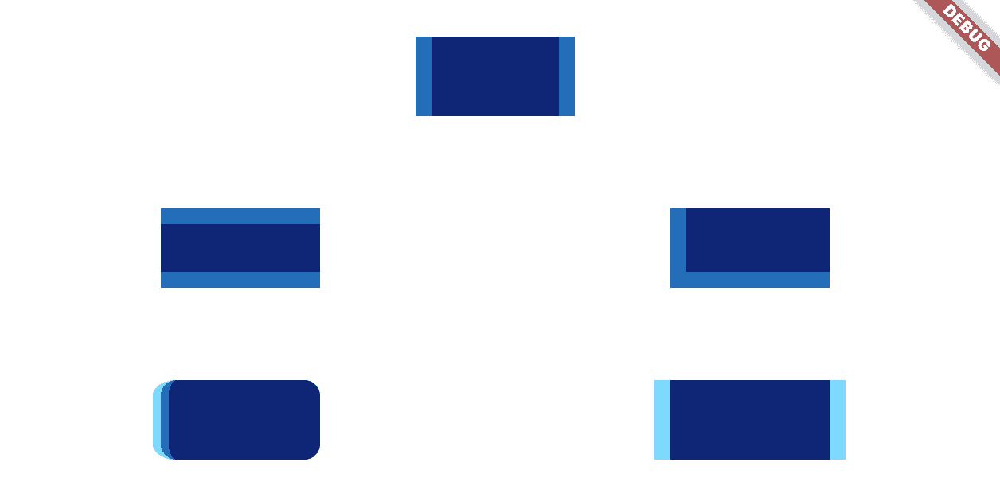

# Example
Example for Non-Uniform Border package.

## Getting Started

The example is a simple app that demonstrates how to create animated borders in Flutter using AnimationController. The app displays a series of rectangles that grow and reduce their borders in an infinite loop.

## Getting Started
To run the Flutter Animated Borders Example, clone or download the repository and open it in your favorite Flutter IDE. Then, run the app on an emulator or physical device.

## Usage
To use the app, simply watch the rectangles grow and reduce their borders in an animated loop. You can also modify the code to customize the appearance or behavior of the rectangles.